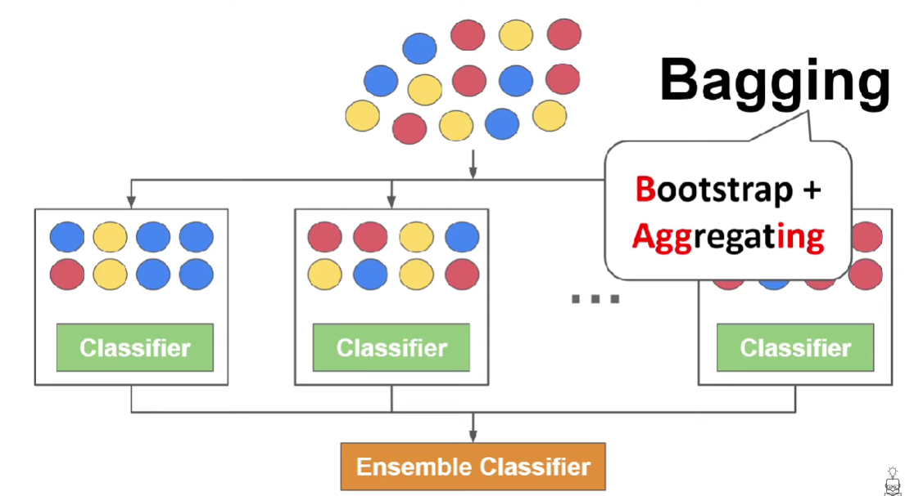
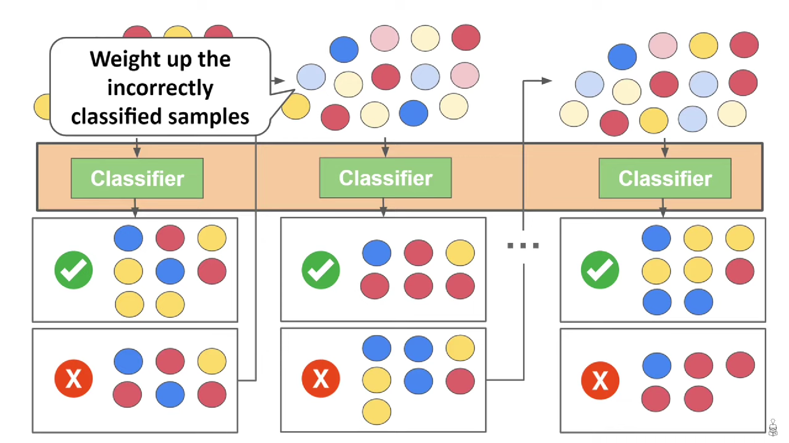
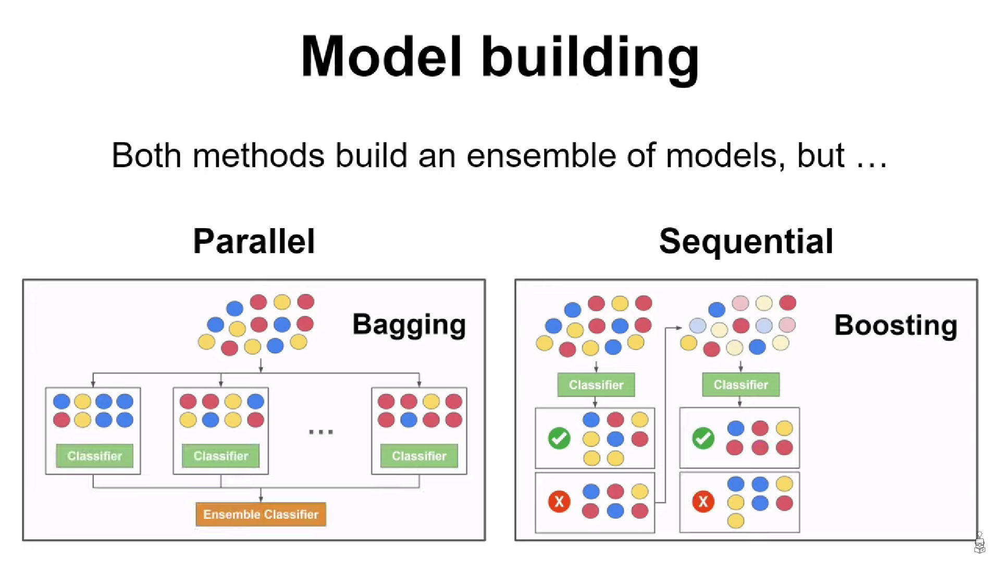

Note: Those algorithm supports training on a **_large dataset_**.
# Bagging
**_Bagging_** (or **_Boostrap_** + **_Aggregating_**) is an **_Ensemble Learning_** algorithm. 
This technique:
1. Generate new **_same-size-datasets_** but doing the boostrap samples randomly.
2. Run the classification on each separated one.
3. Ensemble all results to get classified result.
4. Use **_Classifiers_** to run the **_input data_** and then get the **_most voted label_**.

# Boosting
**_Boosting_** is also an **_Ensemble Learning_** algorithm but it does different ways:
1. Build a **_basic classifier_** to classify the **_main dataset_**.
2. **_Weight up_** the **_wrong samples_** (or **_records_**) on **_output dataset_**.
3. Build the **_next classifier_**, and repeat the jobs until got the **_right classified dataset_**.
4. Ensemble **_sequenced classifiers_** and we got the model.

# Comparison

| Aspect                  | **Bagging** (Random Forest style)                                                                      | **Boosting** (LightGBM, XGBoost style)                                                                            |
|-------------------------|--------------------------------------------------------------------------------------------------------|-------------------------------------------------------------------------------------------------------------------|
| **Main Idea**           | Train many trees **independently** on random samples of data/features, then average their predictions. | Train trees **sequentially**, each new tree focuses on errors from previous trees.                                |
| **Error Handling**      | Reduces **variance** (averages out noise).                                                             | Reduces **bias** (learns from mistakes, adapts to hard cases).                                                    |
| **Overfitting**         | Low risk (stable, robust).                                                                             | Higher risk (but LightGBM has strong regularization: `bagging_fraction`, `feature_fraction`, `min_data_in_leaf`). |
| **Training Speed**      | Faster (parallel training).                                                                            | Slower (sequential), but still efficient in LightGBM.                                                             |
| **Prediction Accuracy** | Good baseline, but weaker on **ranking tasks**.                                                        | Very high accuracy, especially for **ranking / classification**.                                                  |
| **Generalization**      | Decent, but struggles with unseen combinations.                                                        | Strong generalization, adapts better to unseen tasks.                                                             |
| **Use Case Fit**        | Works well for noisy data or quick baseline models.                                                    | Best for tasks needing **ranked recommendations** (your case).                                                    |
| **LightGBM Support**    | `boosting_type="rf"`, `bagging_fraction`, `bagging_freq`.                                              | Default: `boosting_type="gbdt"` or `dart`, with ranking objectives (`lambdarank`, `xendcg`).                      |
